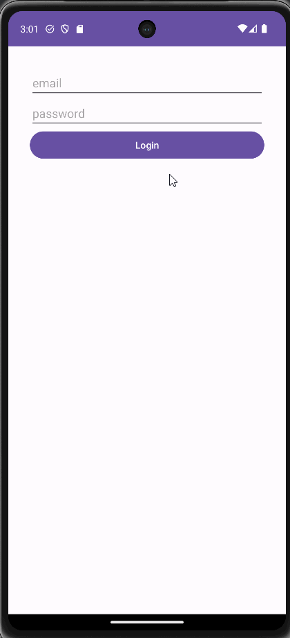

# Project 9: Selfie a Day

An Android app that displays a collection of images for a user, based on their login.
The login and images are stored with Firebase.

## Functionality 

The following **required** functionality is completed:

* [ ] User can select a picture
* [ ] User can add a description to the picture
* [ ] User can submit the picture and description to the database
* [ ] User can log in and log out

The following **extensions** are implemented:

* I didn't implement any extensions for this project.

## Video Walkthrough

Here's a walkthrough of implemented user stories:

GIF created with [LiceCap](http://www.cockos.com/licecap/).

## Notes

Firebase can sometimes have issues with authentication, which can lead to login problems.

## License

    Copyright [2023] [Billy Moore]

    Licensed under the Apache License, Version 2.0 (the "License")
    you may not use this file except in compliance with the License.
    You may obtain a copy of the License at

        http://www.apache.org/licenses/LICENSE-2.0

    Unless required by applicable law or agreed to in writing, software
    distributed under the License is distributed on an "AS IS" BASIS,
    WITHOUT WARRANTIES OR CONDITIONS OF ANY KIND, either express or implied.
    See the License for the specific language governing permissions and
    limitations under the License.
